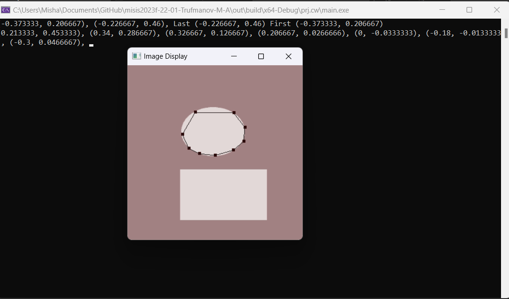

# PoroMarker

## Индивидуальная задача
Глобальная задача - создание инструментов и алгоритмов ручной разметки

### Ручной режим
Пользователь выделяет границы, используя встроенные инструменты, описанные ниже. Координаты точек размеченной области записываются в файл и приводятся к формату для дальнейшей передачи

Инструмены:
* Точка (пользователь проставляет точки по клику мыши)
* Линия (пары соседних точек соединяют прямые)
* Полилиния (для трех и больше точек создаются замкнутый контур)

## Используемые библиотеки
- **GLUT**
- **SOIL**

## Возможный результат режима ручной разметки 

## Ссылка на хранилище проекта
https://github.com/Mihail20052005/PoroMarker-BPM-22-1

