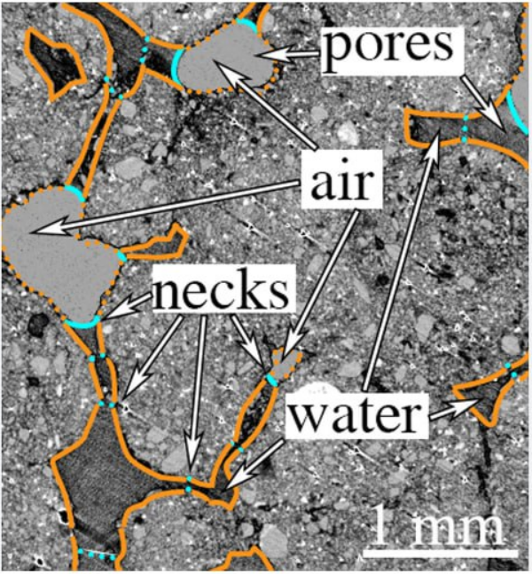

# PoroMarker

## Индивидуальная задача
Глобальная задача - реализовать алгоритм автоматической детекции пор на изображении и создать инструменты для ручной разметки

Разметка работает в трех режимах:
- Автоматический
- Ручной
- Полуавтоматический

### Автоматический режим
Детекция производится программой без участия пользователя. Определяется центр поры и ее границы. Производится отрисовка границ.

### Ручной режим
Пользователь сам выделяет границы, используя описанные ниже инструменты

* Инструмент лассо, позволяющий гибко выделять границы
* Точки, позволяющий описать геометрический примимтивы
* Кривая, фоорму которой можно свободно изменить

## Используемые библиотеки 
- **OpenCV**
- **OpenGl**

## Возможный результат автоматического режима 

## Ссылка на хранилище проекта
https://github.com/Mihail20052005/PoroMarker-BPM-22-1

